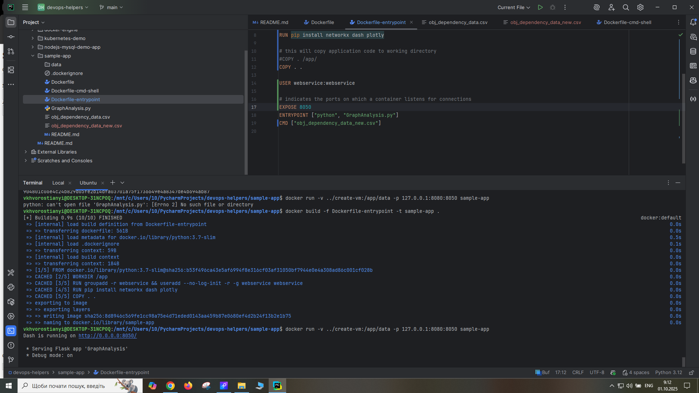

### Homework 2
#### Introduction to Docker and Docker Compose

Task 4  - Run same application using Docker container

Task 5 - Visualize another file with Sample application (use bind mounts & endpoint & cmd combination)

Task 6 - Attach volume to the container

Task 7 - Add network to the containers

Task 8 - Advanced Task - Run LLM chatbot application using Docker Compose
