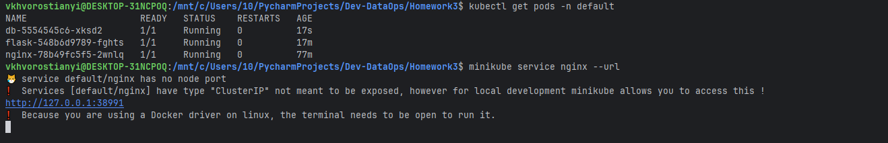
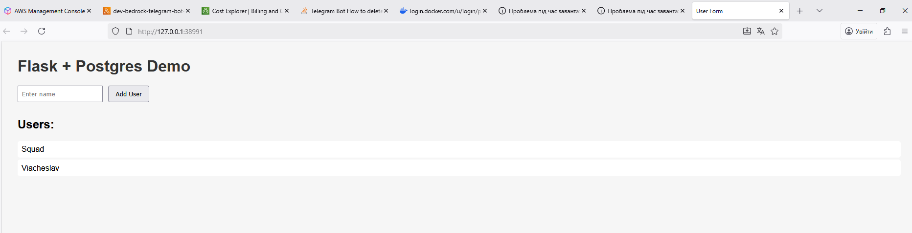
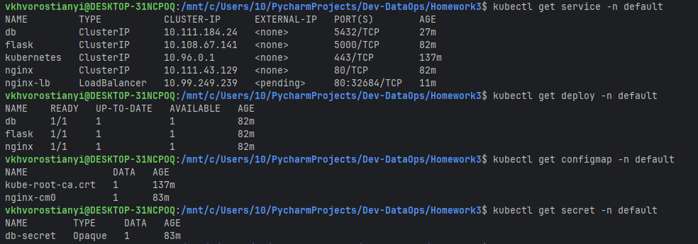

## Homework 3: Kubernetes Basics

1. Application running on Local Kubernetes Cluster (Minikube):
    - Deployed a sample application on Minikube.
    - Verified the deployment and service status.
    - Accessed the application through the Minikube IP and NodePort.
    
    
    