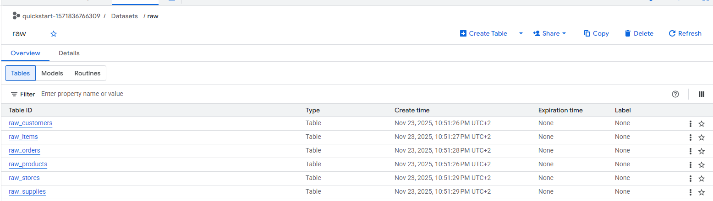
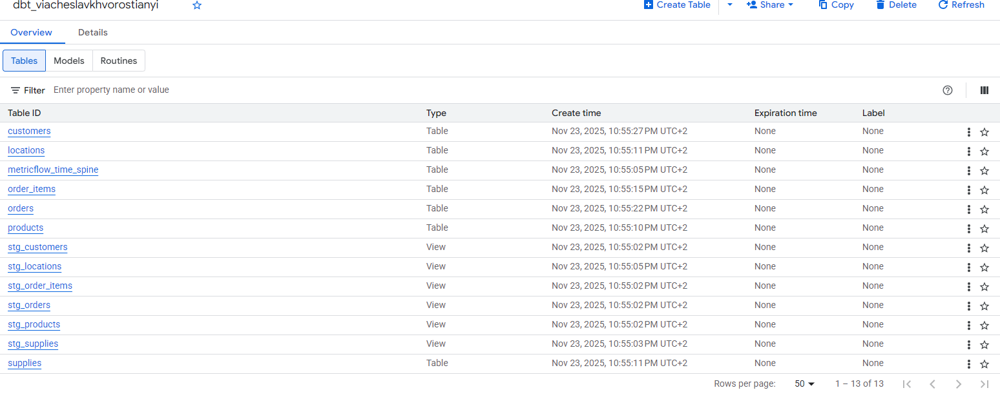
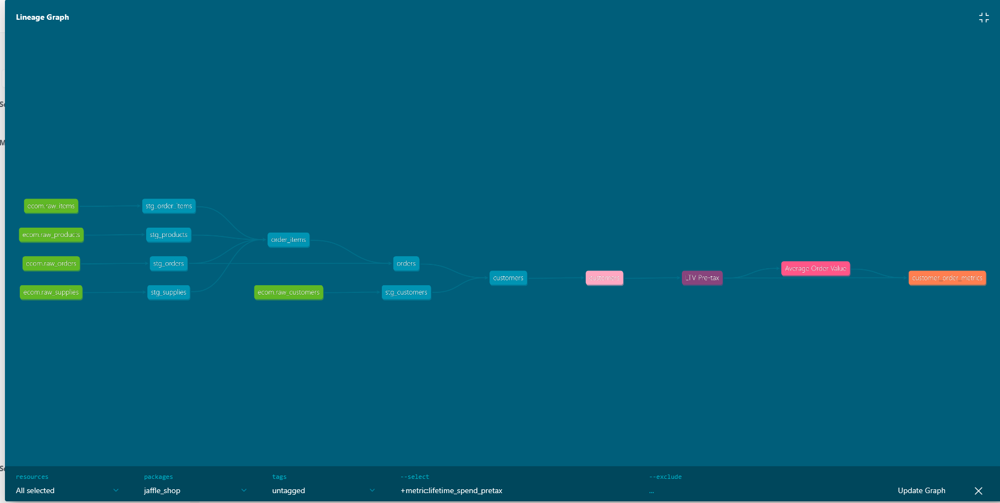

1.Run juffle-shop dbt project  
=======================  

# 2. Quality Data Testing vs Observability Tools

| Tool | Primary Architectural Role | Data Quality (DQ) Approach | Data Observability (DO) Approach | Summary Verdict |
| :--- | :--- | :--- | :--- | :--- |
| **dbt** | Transformation Engine with Integrated Testing | **Foundational & Code-Adjacent.** Excellent for basic, deterministic assertions (not null, unique, referential integrity) that live directly alongside transformation SQL. | **Minimal Native.** Provides point-in-time test results and basic lineage graphs. Requires external plugins (e.g., Elementary) for continuous monitoring or anomaly detection over time. | The essential baseline for modern data stacks. Use it for foundational integrity checks, but do not rely on it as a standalone enterprise observability solution. |
| **Great Expectations** | Dedicated, Deep Data Validation Framework | **Advanced & Statistical.** The gold standard for rigorous, complex profiling (e.g., statistical distribution checks). "Data Docs" are excellent for defining human-readable data contracts. | **Moderate.** Highly effective for validation gates, but can be heavier to configure and maintain for continuous, automated monitoring compared to newer, purpose-built DO tools. | Best suited for mature teams with complex pipelines where deep statistical accuracy and robust, documented data contracts are paramount. |
| **Soda** | Hybrid Quality & Observability Bridge | **Lightweight DSL.** Uses simple YAML-based "SodaCL" for defining common quality rules easily in CI/CD pipelines. | **Strong Automated Monitoring.** Combines explicit rules with automated anomaly detection for trends in volume, freshness, and schema changes over time. | A strong architectural choice for teams seeking a single, modern, and lightweight tool that balances explicit testing with automated health monitoring. |
| **Palantir Foundry** | Integrated Data Operating System (Monolith) | **Platform-Native Gates.** DQ rules are embedded directly as gating mechanisms within the end-to-end orchestration workflow. | **Intrinsic & Pervasive.** Lineage, freshness, and health monitoring are inherent to the platform because it controls the entire data lifecycle from ingestion to consumption. | Unmatched levels of integration and visibility, but requires adopting a high-cost, monolithic ecosystem rather than a modular stack approach. |

# 3. Provide an examples of CI/CD data challenges
## 1. Facilitated the transfer of AWS DMS ownership to another team by re-architecting CI/CD pipelines to operate effectively within a restricted, least-privilege environment.
#### To optimize operational efficiency, we transferred ownership of AWS DMS to the Database Administration team. This involved migrating replication tasks to a separate AWS account with strict access controls. Consequently, we shifted from direct console access to an Infrastructure as Code approach, where all modifications require code submission and DBA approval  
## 2.Migrated EMR cluster provisioning to Amazon MWAA, using Terraform to standardize configuration and ensure reproducible infrastructure  
#### Engineered an automated provisioning pipeline utilizing Amazon MWAA to instantiate EMR clusters on-demand. Transformed the configuration strategy into a strict Infrastructure as Code (IaC) model, where all cluster parameters are version-controlled and deployed programmatically, ensuring auditable and reproducible data environments
## 3. Engineered a fully automated serverless infrastructure for a CRUD application. 
#### Utilized Infrastructure as Code (IaC) to provision and orchestrate AWS Lambda functions and DynamoDB tables, integrating Amazon Cognito to decouple identity provider logic from the core API architecture
## 4. Architected a resilient multi-cluster EMR topology to decouple data processing workloads and ensure high availability. 
#### Successfully navigated the complexities of distributed deployment - including subnet isolation and dependency management - by engineering a standardized provisioning model that guarantees consistent configuration across all cluster instance
## 5. Engineered a Machine Learning-powered analytical application to detect data outliers. 
#### Developed a sophisticated anomaly detection solution that couples a Node.js/Lambda application layer with advanced PySpark analytics. Successfully navigated the integration challenges of a multi-service architecture by establishing Amazon ECR as the central artifact repository, enabling Amazon MWAA to reliably trigger complex data processing jobs that populate PowerBI dashboards

